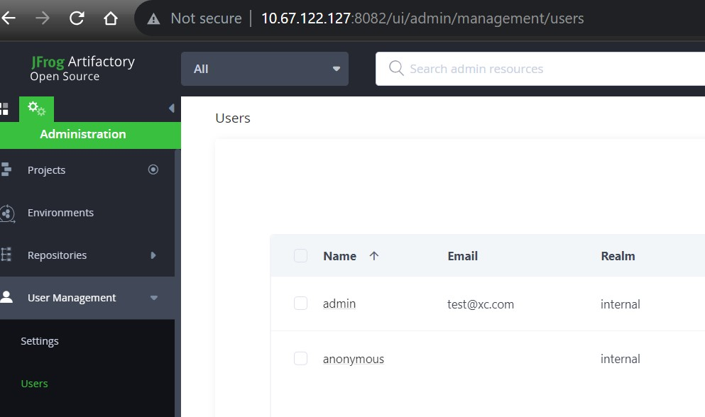
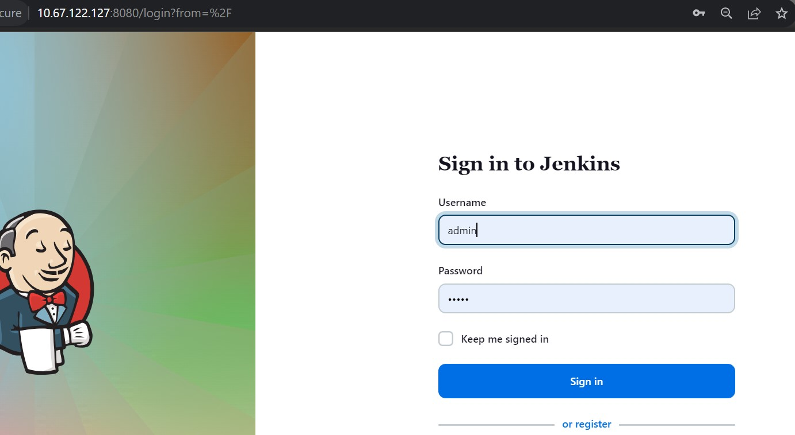
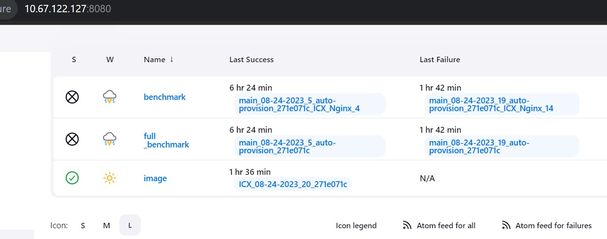

# TWDT 安装指南

本文档旨在说明如何在运行Ubuntu server 22.04 LTS系统的服务器上安装TWDT。

## 1. 确保系统时区与机器所在地理时区一致
为了后续编译 docker 镜像时能够使用正确的安装源，以便加速编译过程，我们有必要将系统时区设置为与机器所在地理区域一致。

如下命令，可用于将时区设置为 '亚洲/上海'。

```
sudo timedatectl set-timezone Asia/Shanghai
```

如果希望列出所有可用时区值，则可以使用如下命令。

```
timedatectl list-timezones
```

## 2. 设置网络代理设置到 /etc/environment文件

后面的安装过程中，脚本文件会基于当前终端的代理设置创建Docker需要的代理配置文件。安装过程包括Docker镜像编译操作。在需要网络代理的环境下，必须用到该配置文件。否则，Docker镜像编译必然会失败。当然，如果你的网络环境下无需代理，可以跳过这一步操作。

同时，为了避免通过代理来访问当前机器本身从而导致失败，有必要将本机IP地址加入no_proxy列表。

/etc/environemtn中加入内容，举例如下：
```
export http_proxy=http://proxy-host:port
export https_proxy=http://proxy-host:port
export no_proxy=localhost,127.0.0.1,10.0.0.0/8,192.168.0.0/16,172.16.0.0/12,10.166.0.0/16,10.244.0.0/16,10.45.247.11,10.45.247.12,10.45.247.13,10.45.247.14
```
然后执行如下命令，确保他们在当前终端中生效。

```
source /etc/environment
```

## 3 定义 TWDTHostIP 环境变量，让它等于我们需要提供服务的IP地址

在终端窗口中，输入如下命令来定义TWDTHostIP环境变量。它将在当前终端和所有子进程中有效。

```
export TWDTHostIP=[Your correct host IP to provice service]
```

提示：可以运行hostname -I 来获取本机所有IP，然后选择正确的那个来填写。

## 4 为前端web服务器生成HTTPS自签名证书

由于我们将通过https安全协议来访问TWDT前端页面，所以安装过程中必须指定私钥和证书文件。为了方便，可以参考以下命令来生成自签名证书。

在 TWDT 源代码目录下，参考如下命令：

```
mkdir -p setup/cert
pushd setup/cert
openssl req -x509 -newkey rsa:2048 -nodes \
    -keyout $TWDTHostIP:5000.key \
    -out $TWDTHostIP:5000.crt \
    -subj "/CN=$TWDTHostIP" \
    -days 3650 \
    --addext "subjectAltName = IP:$TWDTHostIP"

chmod 644 $TWDTHostIP:5000.key $TWDTHostIP:5000.crt
popd

ln -f setup/cert/$TWDTHostIP:5000.key setup/cert/key.pem
ln -f setup/cert/$TWDTHostIP:5000.crt setup/cert/cert.pem
```
如果向正式签名机构提交颁证申请并拿到了证书文件，可以参照最后2条命令为他们做好链接即可。

## 5. 执行 setup/setup-twdt.sh 正式开始 TWDT 的安装

在 TWDT 源码目录，执行如下命令:

```
bash setup/setup-twdt.sh "$(whoami)@$TWDTHostIP"
```
它将一步步引导我们完成所有组件的安装。

首先，脚本会执行到TWDTHostIP的免密ssh登录。看到如下提示时，请输入yes和当前用户的密码。
```
Setting up passwordless ssh to raspadmin@[$TWDTHostIP]...
/usr/bin/ssh-copy-id: INFO: Source of key(s) to be installed: "/home/[$whoami]/.ssh/id_rsa.pub"
The authenticity of host '[$TWDTHostIP] ($TWDTHostIP)' can't be established.
ED25519 key fingerprint is SHA256:vXKc9NkAfQfcYuGmu9cK6wRVVmeIKaHShvd/5qRKaf0.
This key is not known by any other names
Are you sure you want to continue connecting (yes/no/[fingerprint])? yes
/usr/bin/ssh-copy-id: INFO: attempting to log in with the new key(s), to filter out any that are already installed
/usr/bin/ssh-copy-id: INFO: 1 key(s) remain to be installed -- if you are prompted now it is to install the new keys
[$whoami]@[$TWDTHostIP]s password: ________
```

随后，脚本将为当前用户设置 sudo 免密。看到如下提示时，请再次输入当前用户的密码。
```
Setting up passwordless sudo...(sudo password might be required)
[sudo] password for raspadmin: ________
```

然后，脚本会再次询问当前用户密码。看到如下提示时，再输一次当前用户的密码。
```
Now, please tell me current user's(raspadmin) password [used to add current host to be Jenkins agent]: ________
```

到这一步，我们可以安静的等待安装脚本自己执行，直至完成。

如果一切顺利，我们将看到如下提示了，则表示安装完成了。
```
Congratulation! Seems like everything going well. Next step, please do some configuration about changing Jfrog password and creating essential repository follow doc/install-guide.md to make sure TWDT can work properly.
```

## 6 查询之前输入的密码

有时，我们可能会忘记安装过程中输入的密码是什么，或后来改成了什么密码。别担心，只要能通过ssh访问到安装用的主机，就用如下命令可以从 Vault 密码保险箱中读出他们。
事实上，我们并不需要费力地记住这么许多的烦人的密码。

```
vault kv get -format=json kv/wsf-secret-password
```

输出大致如下，我们可以根据需要拿到我们所需的各项用户名和密码。
```
$ vault kv get -format=json kv/wsf-secret-password
{
  "request_id": "706e6dca-fba9-948c-3b01-bee8fe11f124",
  "lease_id": "",
  "lease_duration": 2764800,
  "renewable": false,
  "data": {
    "JenkinsUrl": "http://[TWDTHostIP]:8080",
    "TWDTEmailSenderPassword": "",
    "TWDTHost": "[TWDTHostIP]",
    "TWDTHostPort": "22",
    "TWDTHostUser": "[user]",
    "TWDTJenkinWorkspaceDir": "/opt/benchmarking.uitools.twdt/setup/../jenkins/runtime/",
    "TWDTJenkinsPassword": "[password]",
    "TWDTJenkinsUser": "[user]",
    "TWDTJfrogPassword": "[password]",
    "TWDTOSPassword": "[password]",
    "TWDTPortalEmail": "[email]",
    "TWDTPortalPassword": "[password]",
    "TWDTPortalUser": "[user]",
    "TWDTPostgresPassword": "[password]",
    "TWDTPostgresUser": "[user]"
  },
  "warnings": null
}
```

## 7 配置Jfrog

由于 Jfrog 系统有强密码策略要求，我们在前面安装过程中，为其指定了一个高强度的密码。然而，那只是指定了 TWDT 用它去连接 Jfrog，而不是 Jfrog 中设置了这个值。为了让 TWDT 正常访问 Jfrog，我们现在来登录 Jfrog 并将前面设置的值填入 Jfrog 。

### 7.1 登录 Jfrog
访问 http://[TWDTHostIP]:8082/ui/login/ (别忘了是http而不是https协议)，默认用户名为admin， 而密码也是admin。

###### 

如果网页显示“The JFrog Platform is warming up and should be ready shortly”, 且一直停在欢迎界面，则可能是 Jfrog 遇到了一些问题。 可以在终端里执行如下命令来重启，然后再尝试登录。

```
docker restart jfrog
```

首次登录时，会弹出设置向导。我们可以根据向导完成下面的设置项。但并不是每次登录时都会弹出该向导，为了方便，我们基于页面导航菜单进行说明。 建议关闭向导，按照下面提示来完成设置。

## 7.2 修改 admin 密码

点击"User Management"侧边栏菜单,选择 Users。

###### 

点击 'Name'栏里的 'admin' 用户名, 随后填写邮箱地址。

###### 

输入前面为 Jfrog 设置的密码, 点击右下角的 'Save' 按钮。注意，必须与前面的密码一致，否则 Jfrog 无法正常工作。

###### 

### 7.3 创建 JFrog 仓库

现在，我们来创建 TWDT 必须要用到的 Jfrog 仓库。

点击侧边栏的 Respositories, 选择 Respositories。

###### 

点击右上角的 '+ Add Repositories', 选择 "Local Repository"。

###### 

在弹出的 'Select Package Type' 页面选择 generic 图标.

###### 

为 'Repository Key' 字段输入 'auto_provision', 然后点击 'Create Local Repository'。

###### 

Repository 就此创建成功。

###### 

## 8 确认所有组件都成功启动

### 8.1 登录 TWDT 首页

浏览器访问 https://[TWDTHostIP]:8899 然后输入设置的 TWDT 用户名和密码, 点击 Login 登录。

###### 

### 8.2 登录 jenkins

访问 http://[TWDTHostIP]:8080/ ,然后输入设置的 Jenkins 用户名和密码，敲击键盘 Enter 登录。

##### 

确认 Jenkins 三个 job，full_benchmark, benchmark, image 都存在。

##### 

点击页面右上角 'admin' , 然后选择 'Credentials'.

确认 'Credentials' 段落的 'ID' 栏里存在 'Jfrog' 和 'node1Pass'。'Jfrog' 是 Jfrog 的设置，而 'node1Pass' 是 TWDT 的密码。

##### 

点击右上角 'admin', 然后选择 'Configure'。

确认 'API Token' 段落有 'my-vaas-token' 存在，它用于执行 Jenkins API 请求。

##### 

点击页面左上角的 'Jenkins' 图标， 然后选择 'Manage Jenkins', 再选择 'System'。

确保页面里 'VAULT_ADDR' 和 'VAULT_TOKEN' 存在。

##### 

点击页面左上角 'Jenkins' 图标，然后选择 'Manage Jenkins', 再选择 'Nodes'。

确认 'Nodes List' 里存在 'node1', 且 'Clock Difference' 状态为 'In Sync'。

##### 

